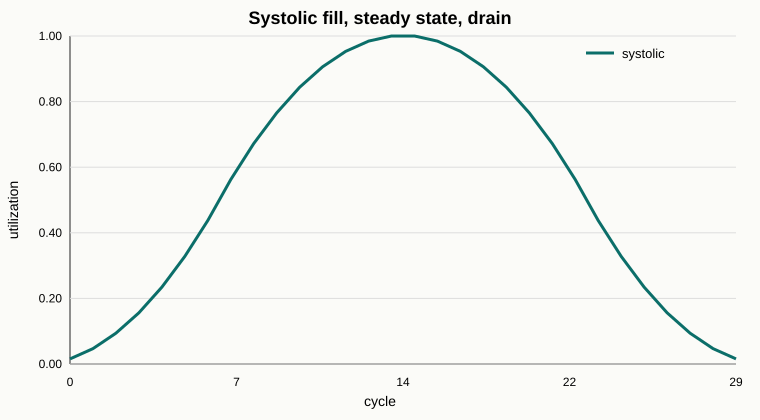
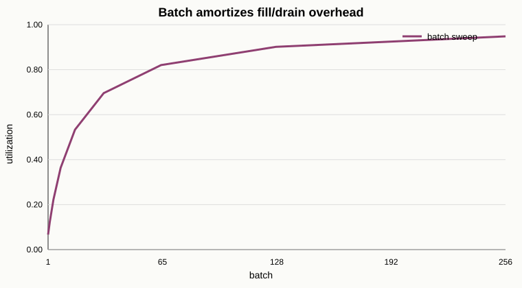
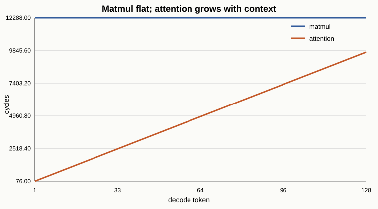
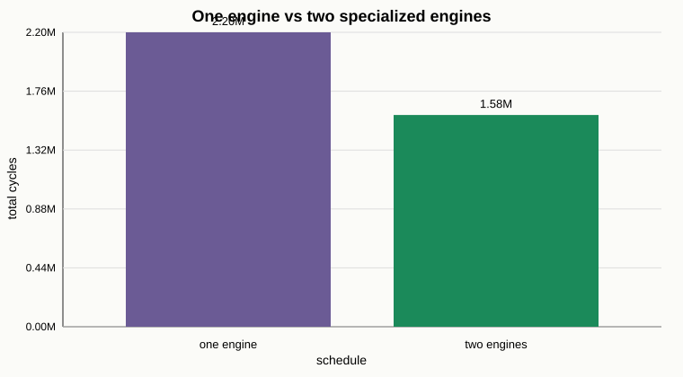
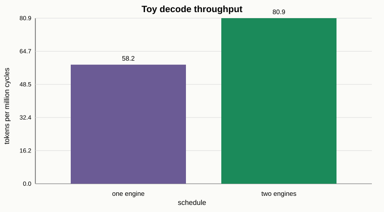

# Dual-Engine Transformer Simulator

This repo is a small C++ simulator for building intuition about why transformer inference hardware
can benefit from splitting work across two specialized engines:

- a systolic/matmul engine for dense matrix multiplication
- an attention/KV-cache engine for context-dependent streaming work

It is a learning model for me to understand the basics of how Sohu works. The goal was to
make the tradeoff visible: matmul has regular, reusable structure, while decode-time attention grows
with context length and has a different memory/compute shape.

## How To Run

Build and run the C++ simulator:

```sh
make run
```

The program writes JSONL traces into `traces/`.

Generate SVG charts from the traces:

```sh
python3 tools/render_svg_charts.py
```

If you have matplotlib installed, you can also generate PNG charts:

```sh
python3 viz/plot.py
```

Run the lightweight trace check:

```sh
python3 tools/smoke_check.py
```

## What The Demo Produces

### 1. Systolic Utilization



The systolic trace models a PE grid computing a matrix multiply tile. For a general multiply:

```text
A: rows x k
B: k x cols
C: rows x cols
```

the simulator treats the systolic array as a `rows x cols` grid. PE `(i, j)` owns output element
`C(i, j)`.

The PE starts when the wavefront reaches it:

```text
start_cycle = i + j
```

At cycle `t`, that PE is working on dot-product index:

```text
dot_index = t - (i + j)
```

If `0 <= dot_index < k`, the PE performs:

```text
C(i, j) += A(i, dot_index) * B(dot_index, j)
```

The total cycle count is:

```text
(rows - 1) + (cols - 1) + k
```

The first two terms are the wavefront fill/drain cost. The `k` term is the actual dot-product depth.
For the default demo, `N = 8` and `K = 16`, so the array runs for `30` cycles and reaches `64/64`
active PEs at peak.

Note that the array starts almost empty, then the wavefront fills it up, then for a short window every PE is doing useful work, then it drains back down. This is the whole reason systolic array are so much better than normal naive matrix multiplication. Once the wave is full, many MACs are
happening at the same time which makes it much faster.

### 2. Batch Sweep



Another thing we want to think about is if the systolic array has a fixed fill/drain overhead, how much does more consecutive work help? In other words how much does batching help?

The model uses:

```text
overhead = (rows - 1) + (cols - 1)
cycles = overhead + batch
utilization = batch / cycles
```

Here, `batch` is the number of activation rows:

```text
X: batch x hidden
W: hidden x output
Y: batch x output
```

Larger batches give the hardware more work to stream through after the array is full. That amortizes
the same fixed fill/drain overhead. In the default `8 x 8` demo, utilization rises from about `6.7%`
at batch `1` to about `94.8%` at batch `256`.

This makes sense. Batch size of `1` is brutal because you pay the fill/drain cost and barely give the
array anything to multiply with. As batch grows, the same setup cost gets spread across way more work. If you can keep feeding the machine a big stream of transformer work, utilization starts climbing fast.

### 3. Matmul vs Attention During Decode



The decode contrast shows a key transformer inference issue:

- matmul work per generated token is modeled as fixed
- attention work grows as the context length grows

For one attention head at context length `L` and head dimension `D`, the toy attention model uses:

```text
KV reads      = 2L
MACs          = 2LD
softmax ops   = 3L
cycles        = ceil(MACs / lanes) + softmax_ops
```

Why those terms:

- `2L` KV reads: for each context token, read one key vector and one value vector.
- `2LD` MACs: compute `q * K^T` and then `softmax(qK^T) * V`.
- `3L` softmax ops: simple softmax does exponentiate, sum, and divide over `L` scores.
- `lanes`: parallel MAC lanes in the attention engine. More lanes means more MACs per cycle.

The default demo uses `d_k = 8`, `num_heads = 4`, and `128` decode tokens. Attention grows from `76`
cycles to `9728` cycles, while the toy matmul cost stays fixed at `12288` cycles.

Note that the matmul is a flat line because the model gives each decode step the same
feed-forward/projection cost: `3 * d_model * d_model` for QKV projection, `d_model * d_model` for
output projection, and `2 * d_model * d_ff` for the FFN, which is `12288` cycles with `d_model = 32`
and `d_ff = 128`. Attention is the line that keeps walking upward because every new token has more
KV cache to look back at. This is the split that Sohu takes advantage of. One side is regular dense
work, the other side is growing context work.

## Serial vs Overlapped Scheduling



The simulator emits two schedule traces:

- `traces/schedule_serial.jsonl`
- `traces/schedule_overlap.jsonl`

The serial schedule models one timeline:

```text
token 1 matmul -> token 1 attention -> token 2 matmul -> token 2 attention -> ...
```

The overlap schedule models two independent engines:

```text
matmul engine:    token 1 matmul -> token 2 matmul -> token 3 matmul -> ...
attention engine:        token 1 attention -> token 2 attention -> ...
```

This shows the architectural idea in its simplest form. If matmul and attention use different
engines, work that would otherwise occupy one shared path can make progress on two specialized paths.

For the default 128-token decode demo, the total work is the same in both schedules:

```text
matmul work:     1,572,864 cycles
attention work:    627,456 cycles
```

The one-engine schedule runs those pieces serially and finishes in:

```text
2,200,320 cycles
```

The two-engine schedule overlaps attention with following matmul work and finishes in:

```text
1,582,592 cycles
```

That is:

```text
617,728 cycles saved
1.39x throughput improvement
28.1% fewer total cycles
```

The work did not shrink. The machine just stops waiting around as much. With one engine, matmul and attention take turns. With two engines, the attention side can work while the matmul side moves on. That is why Sohu is so good. It's the same transformer, same basic ops but way better timeline.

### Toy Throughput



Now we can say the same thing in throughput terms. Throughput is:

```text
tokens generated / total cycles
```

For this demo, both schedules generate `128` tokens.

```text
one engine:  128 / 2,200,320 = 58.2 tokens per million cycles
two engines: 128 / 1,582,592 = 80.9 tokens per million cycles
```

That is the throughput bet in the tiny version. We did not make the transformer smaller. We did not
delete attention. We just gave the machine a better way to keep work moving. This is why throughput
is such a big deal for Etched: when you are serving many requests, the question becomes "how many
tokens can this box produce per second?" and the two-engine schedule is clearly producing more tokens
for the same cycle budget.

## Operation Cost Summary

### Naive Matmul

For:

```text
A: M x K
B: K x N
C: M x N
```

the reference implementation performs:

```text
M * N * K MACs
```

### Systolic Matmul

The systolic implementation performs the same number of MACs:

```text
M * N * K MACs
```

However we do many MACs in parallel across many PEs.
With one PE per output element, the wall-clock cycle estimate becomes:

```text
(M - 1) + (N - 1) + K
```

compared with a scalar one-MAC-at-a-time estimate of:

```text
M * N * K
```

It's the same work but we take advantage of the spatial parallelism.

### Attention

For decode attention, the new token attends over the KV cache:

```text
q: 1 x D
K: L x D
V: L x D
```

The two main compute phases are:

```text
q * K^T                 -> 1 x L scores
softmax(scores) * V     -> 1 x D output
```

That gives the toy cost:

```text
2 * L * D MACs
```

Unlike the fixed matmul cost in the demo, this grows with `L`, the current context length.

## How This Relates To Sohu

This project was inspired by an article analyzing Etched/Sohu from patents, public claims, and first
principles. 

This repo was a way for me to learn the core mechanisms that make transformer-only hardware compelling: utilization, batching, attention
specialization, and overlap.

We can also see that:

- Transformer inference has two major personalities: dense matmul/feed-forward work and KV-cache attention work.
- Dense feed-forward work likes large, regular systolic-style dataflow and high PE utilization.
- Decode attention is more context-length-dependent, memory/streaming shaped, and includes softmax.
- A dual-engine design gives each workload a compute path shaped for its own behavior.
- Independent memory paths can let weight traffic and KV-cache traffic move at the same time.
- If the engines run independently, feed-forward/matmul work and attention work may overlap.

That is the architecture idea this demo makes visible. It helps explain why a transformer ASIC can
be an excellent fit for high-throughput inference alongside more general-purpose accelerators.

### Why The Upside Can Be Large

The toy computations show three compounding wins that make a Sohu-like architecture exciting.

First, systolic matmul does the same math as naive matmul, but it does many MACs in parallel. For an
`M x K` times `K x N` multiply, the scalar work is:

```text
M * N * K MACs
```

The systolic cycle model is:

```text
(M - 1) + (N - 1) + K
```

The main idea is keep a large grid of MAC units busy with a wavefront of useful work.

Second, batching improves utilization. At high batch size, the same weights can be reused across many
rows/tokens/requests:

```text
X: batch x hidden
W: hidden x output
Y: batch x output
```

The systolic engine sees a bigger effective matrix, and fill/drain overhead gets amortized across
more useful work. The demo's batch sweep shows this clearly: utilization rises from about `6.7%` at
batch `1` to about `94.8%` at batch `256`.

Third, attention and feed-forward have different shapes. Feed-forward wants big regular matmuls.
Attention wants KV-cache streaming, score computation, softmax, and value aggregation. A dual-engine
chip can let these two streams make progress together.

Put together, the positive story is:

```text
more specialized compute
+ higher systolic utilization
+ better batch throughput
+ separate attention path
+ less memory-path contention
+ overlap between engines
= a credible path to very high transformer inference throughput
```

### Why Separate Attention?

Attention interleaves three different kinds of work:

```text
q * K^T
softmax
softmax(scores) * V
```

The matmul pieces want MAC throughput. The softmax piece wants vector/nonlinear work. The KV cache
wants streaming reads whose size grows with context length.

This simulator mirrors that point with two deliberately simple models:

- `systolic.cpp` models regular matmul timing and PE utilization.
- `attention.cpp` models attention cost as context-length-dependent KV reads, MACs, and softmax ops.

The overlap schedule then asks: what if these two kinds of work are allowed to make progress on
separate engines?

## Files

- `cpp/matrix.*`: small row-major matrix class.
- `cpp/naive_matmul.*`: reference matmul implementation.
- `cpp/systolic.*`: systolic timing model and systolic-style matmul.
- `cpp/attention.*`: KV-cache attention cost model.
- `cpp/schedule.*`: serial and overlapped decode schedules.
- `cpp/trace.*`: JSONL trace writers.
- `tools/render_svg_charts.py`: no-dependency SVG chart generator.
- `tools/smoke_check.py`: sanity checks for generated traces.
- `viz/plot.py`: optional matplotlib PNG chart generator.

## Model Focus

This model keeps the spotlight on the pieces that make the Sohu story exciting:

- systolic wavefront timing
- PE utilization
- batch amortization
- attention growth with context length
- simple softmax cost
- separate matmul and attention schedules
- overlap between specialized engines
- toy throughput

That simplicity is the feature: the simulator is small enough to reason about by hand while still
showing why transformer-focused hardware can be such a strong design direction.
